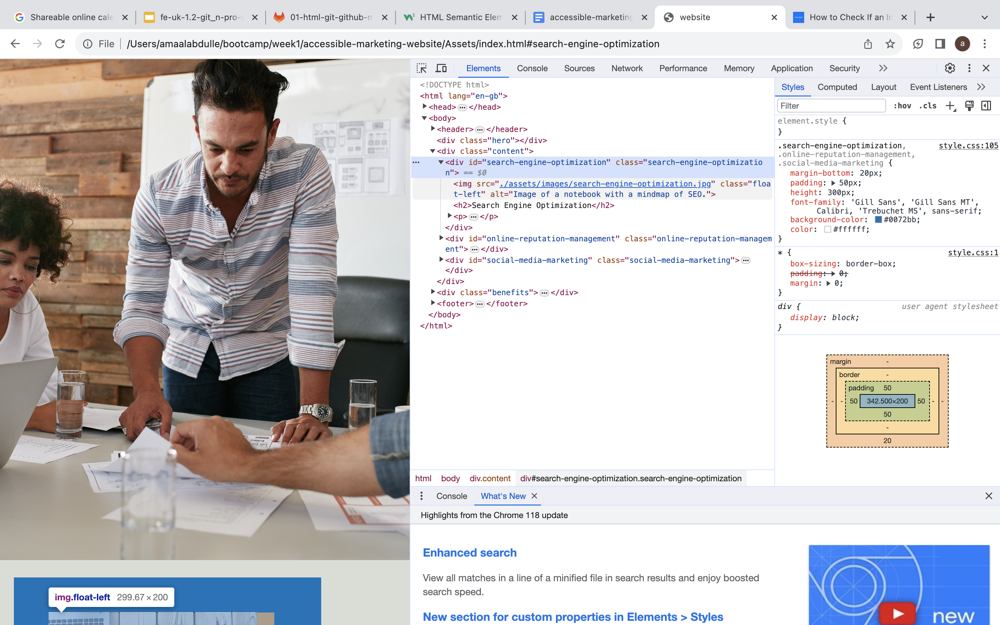

# accessible-marketing-website

## Description

In this weeks challenege, I reworked a marketing website to become more accessible to users to improve navigation and add to user experience. I built this project to ensure that all potential users have the same user experience and can navigate with ease around the site. These improvement mainly benefit impaired/restricted people. During this project, I learnt what features add to accessiblity (i.e. adding alt to img) and how to deploy this project.

## Installation

No steps required to install project.

## Usage

You can view the alt text of an image using either a screen reader or checking the websites html code. To view using the code: right click (mouse or trackpad) and click inspect, then check the html code for the alt attribute.

Link to deployed website: https://amaalabdulle.github.io/accessible-marketing-website/

## Credits

Collaborated with the EdX Web Development team. All html & css was suplied by them. Accessibility modifications was done by myself.

## License

N/A

